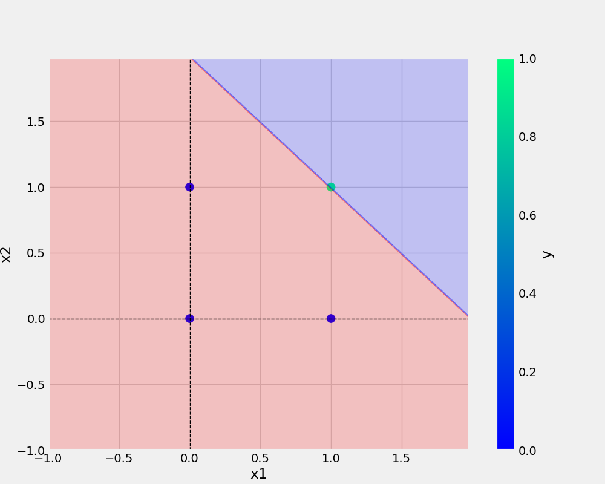

# Perceptron

___
## Add image -


___
## Python code

```python
def main(data, modelName, plotName, eta, epochs):
    df = pd.DataFrame(data)
    print(df)
    X, y = prepare_data(df)
    model = Perceptron(eta=eta, epochs=epochs)
    model.fit(X, y)
    _ = model.total_loss()
    save_model(model, filename=modelName)
    save_plot(df, plotName, model)
```
___
## dataset

x1 | x2 | y
-|-|-
0|0|0
0|1|0
1|0|0
1|1|1

___
## GNU General Public License v3.0 © NryReddy